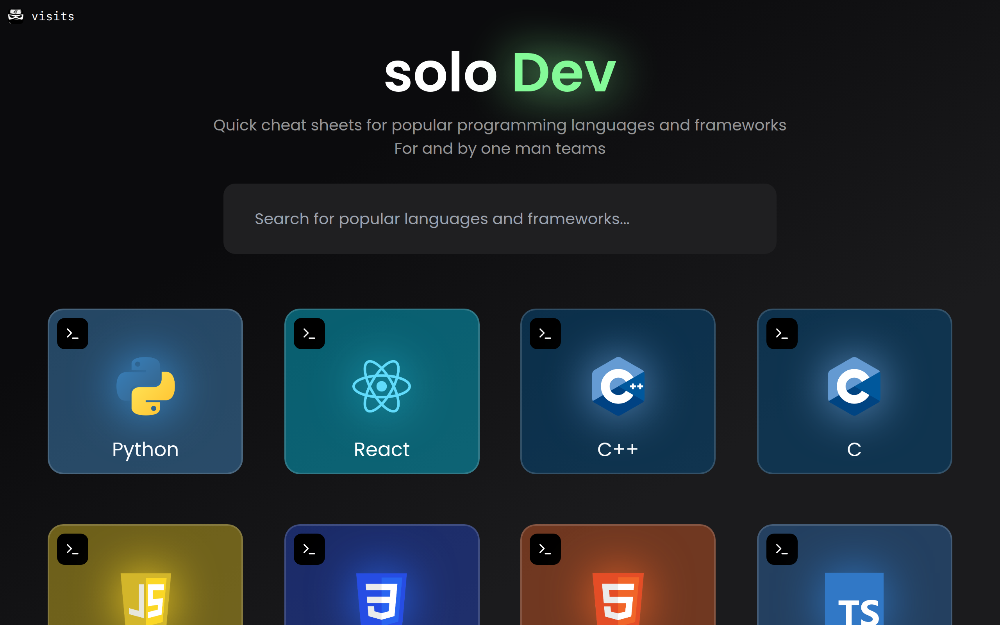
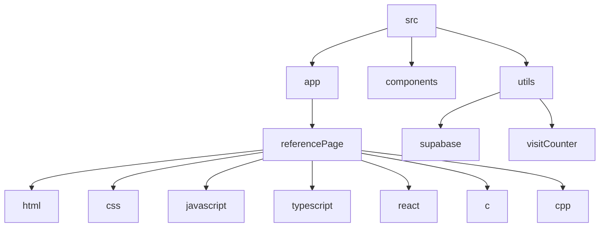

# Solo Dev Documentation


## 🗂️ Description

The Solo Dev project is a comprehensive developer resource built with Next.js, TypeScript, and Tailwind CSS. This platform provides detailed reference guides for various programming languages, including HTML, CSS, JavaScript, TypeScript, React, C, C++, and more. The project aims to assist developers in learning and mastering different technologies through well-structured documentation and code examples.

## ✨ Key Features

### **Reference Guides**
- Detailed documentation on HTML, CSS, JavaScript, TypeScript, React, C, C++, and more
- Code snippets and explanations for each concept

### **Tech Stack**
- Built with Next.js for performance and SEO optimization
- Uses TypeScript for static typing and better code maintainability
- Styled with Tailwind CSS for a responsive and modern design

### **Utilities**
- Supabase integration for visit tracking
- Custom hooks for mobile detection and visit counting

## 🗂️ Folder Structure


## 🛠️ Tech Stack


## ⚙️ Setup Instructions

### Prerequisites
- Node.js (v18 or higher)
- npm or yarn

### Steps to Run
1. **Clone the Repository**
   ```bash
   git clone https://github.com/abhraneeldhar7/solo-dev.git
   ```
2. **Install Dependencies**
   ```bash
   npm install
   ```
3. **Start the Development Server**
   ```bash
   npm run dev
   ```
4. **Open Your Browser**
   Navigate to `http://localhost:3000` to view the project.

## GitHub Actions
The project uses GitHub Actions for automated workflows. These workflows include:
- **Linting and Type Checking**: Ensures code quality and adherence to standards.
- **Build and Deployment**: Automatically builds and deploys the project on push to the main branch.

## 🤝 Code Quality

The project maintains high code quality through:
- **ESLint Configuration**: Defined in `.eslintrc.json` and `eslint.config.mjs`.
- **TypeScript Configuration**: Configured in `tsconfig.json`.
- **Prettier and Tailwind CSS**: Integrated for consistent styling and formatting.

## 📊 Visit Tracking

The project uses Supabase for visit tracking. The `utils/supabase/client.ts` file initializes the Supabase client, and `utils/visitCounter.tsx` component increments the visit count for each page view.


<br><br>
<div align="center">

<h3>Abhra the Neel</h3>
<p>Full-stack developer with expertise in web, Android, and server development. Most projects are private due to being production code.</p>
</div>
<br>
<p align="right">
  <a href="https://gitfull.vercel.app">Made by GitFull</a>
</p>
    