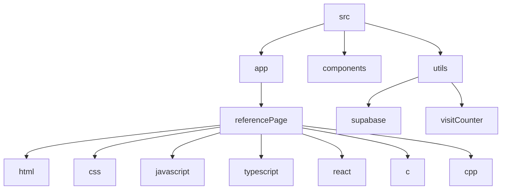

# Solo Dev Reference Guide

## 🗂️ Description

The Solo Dev repository is a comprehensive reference guide for developers, covering various programming languages, including HTML, CSS, JavaScript, TypeScript, React, C, and C++. This project aims to provide a centralized resource for developers to learn and review key concepts, syntax, and best practices.

The guide is structured into individual pages for each language, featuring code snippets, explanations, and examples to facilitate learning and reference. The project utilizes Next.js, React, and Tailwind CSS to provide a modern and responsive user interface.

This repository is ideal for developers of all levels, from beginners looking to learn new languages to experienced developers seeking to refresh their knowledge or explore new technologies.

## ✨ Key Features

### **Reference Pages**
* Comprehensive guides for HTML, CSS, JavaScript, TypeScript, React, C, and C++
* Code snippets and examples to illustrate key concepts
* Structured with headings, paragraphs, and sections for easy navigation

### **Tech Stack**
* Built with Next.js, React, and Tailwind CSS
* Utilizes Supabase for visit counter functionality

### **Custom Components**
* Visit counter component to track page visits
* Custom hook for detecting mobile screen width

## 🗂️ Folder Structure

## 🛠️ Tech Stack

* Next.js
* React
* Tailwind CSS
* Supabase
* TypeScript
* ESLint
* PostCSS

## ⚙️ Setup Instructions

* Git clone the repository: https://github.com/abhraneeldhar7/solo-dev.git
* Install dependencies: `npm install` or `yarn install`
* Start the development server: `npm run dev` or `yarn dev`
* Open your browser and navigate to `http://localhost:3000` to view the reference guide