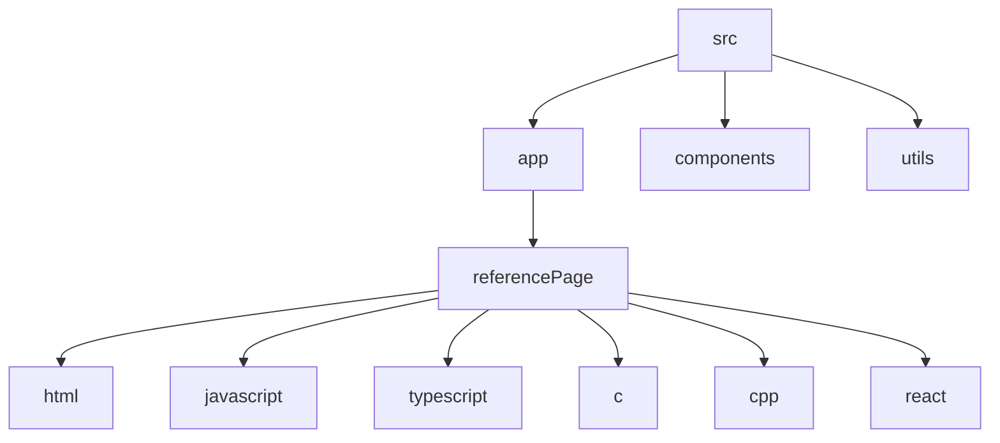

# Solo Development Repository

## 🗂️ Description

The Solo Development Repository is a comprehensive developer portfolio and documentation site built with Next.js, TypeScript, and Supabase. This project serves as a centralized hub for showcasing various programming languages, technologies, and developer tools. It provides detailed reference guides, code snippets, and explanations for a wide range of topics, making it an invaluable resource for developers of all skill levels.

## ✨ Key Features

### **Reference Guides**
* Comprehensive documentation for various programming languages, including:
	+ HTML
	+ JavaScript
	+ TypeScript
	+ C
	+ C++
	+ React
* Detailed explanations and code snippets for each topic

### **Developer Tools**
* Integration with Supabase for data storage and retrieval
* Customizable components and layouts using Tailwind CSS
* Visit counter and analytics

## 🗂️ Folder Structure

## 🛠️ Tech Stack

## ⚙️ Setup Instructions

To run the project locally, follow these steps:

* Clone the repository: `git clone https://github.com/abhraneeldhar7/solo-dev.git`
* Install dependencies: `npm install` or `yarn install`
* Start the development server: `npm run dev` or `yarn dev`

## 📁 Configuration Files

The project uses the following configuration files:

* `next.config.ts`: Next.js configuration file
* `postcss.config.mjs`: PostCSS configuration file
* `tailwind.config.ts`: Tailwind CSS configuration file
* `.eslintrc.json`: ESLint configuration file
* `tsconfig.json`: TypeScript configuration file

## 🤝 GitHub Actions

This repository uses GitHub Actions for automated workflows. The workflow files are located in the `.github/workflows` directory.

## 📝 Code Organization

The project is organized into the following directories:

* `app`: Next.js pages and components
* `components`: Reusable UI components
* `utils`: Utility functions and helpers

## 📊 Supabase Integration

The project uses Supabase for data storage and retrieval. The Supabase client is configured in `utils/supabase/client.ts`.

  

<h3>Abhra the Neel</h3>

Full-stack developer with expertise in web, Android, and server-side development. Most projects are private due to being production code.

 

  <a href="https://gitfull.vercel.app">Made by GitFull</a>

    